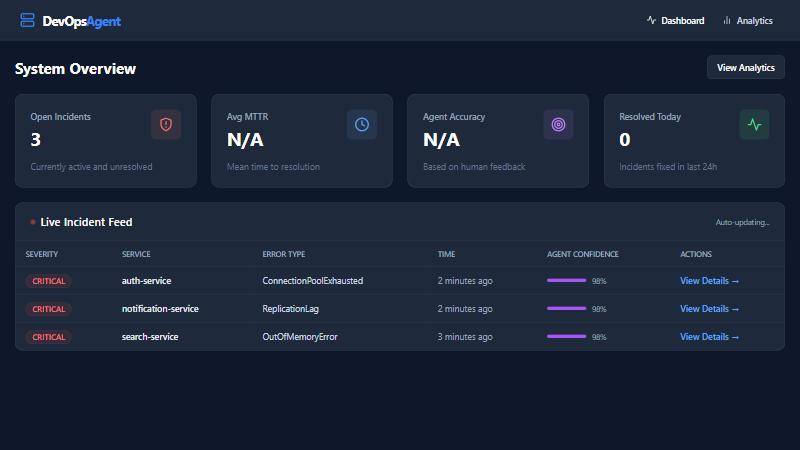
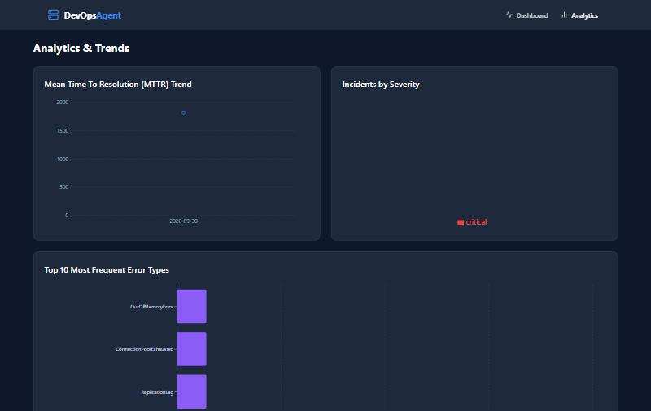

# DevOps Incident Agent 🤖

[](https://opensource.org/licenses/MIT)
[](https://github.com/owner/devops-incident-agent/actions/workflows/ci.yml)
[](https://github.com/owner/devops-incident-agent)
[](https://python.langchain.com/docs/langgraph)

A production-grade Autonomous DevOps Incident Response Agent. Monitors applications in real-time, leverages a 5-agent LangGraph AI pipeline to diagnose root causes, and automatically orchestrates responses (GitHub Issues, PRs, and Telegram alerts).



## ✨ Features

- **5-Agent AI Pipeline:** Powered by LangGraph and Google Gemini.
  - *Anomaly Detector:* Identifies true errors vs noise.
  - *Incident Correlator:* Groups related incidents.
  - *Root Cause Analyzer:* Performs deep causal reasoning.
  - *Fix Suggestion Agent:* Recommends actionable fixes and code snippets.
  - *Response Orchestrator:* Dispatches to GitHub, Telegram, and Slack.
- **Incident Correlation Engine:** Reduces alert fatigue by grouping related logs.
- **Auto-Resolution:** Automatically marks incidents as resolved if no recurrence happens in a configurable window.
- **Real-Time Dashboard:** React frontend displaying live incidents, MTTR trends, and agent accuracy.
- **Webhook Integration:** Easily push logs from any app using HMAC-SHA256 secured webhooks.
- **Built-in Log Simulator:** Test and demo the system with realistic mock logs.

## 📸 Screenshots

### Live Dashboard
Real-time feed of open incidents with severity, affected service, error type, and per-incident AI confidence.


### Analytics & Trends
MTTR trend, incidents by severity, and the most frequent error types across all incidents.



## 📊 Real-World Impact

This is a portfolio/demo project. It has not yet been run against a production
workload, so no real-world impact numbers are claimed here. The dashboard
computes these metrics live (incidents detected, MTTR trend, agent accuracy
from human feedback, correlation rate) — run the stack with the built-in log
simulator to generate data and see them populate on the Analytics page.

## 🚀 Quick Start

1. **Clone the repo:**
   ```bash
   git clone https://github.com/owner/devops-incident-agent.git
   cd devops-incident-agent
   ```

2. **Configure environment:**
   ```bash
   cp .env.example .env
   # Edit .env and add your GEMINI_API_KEY, GITHUB_TOKEN, TELEGRAM_BOT_TOKEN
   ```

3. **Start the stack:**
   ```bash
   docker-compose up -d
   ```

4. **Access the Dashboard:**
   Open `http://localhost:3001` in your browser.
   The backend API and interactive docs are at `http://localhost:8080/docs`.

   > Ports: `docker-compose` publishes the frontend on **3001** and the backend
   > on **8080**. (When running the frontend with `npm run dev` for local
   > development, Vite serves it on **3000** instead.)

## 🔌 Webhook Integration

To monitor your own application, send a POST request to the webhook endpoint.

1. Register your app in the Dashboard to get a `webhook_secret`.
2. Compute the HMAC-SHA256 signature of the JSON payload.
3. Send the logs:

```bash
curl -X POST http://localhost:8080/api/v1/logs/webhook/<APP_ID> \
     -H "Content-Type: application/json" \
     -H "X-Signature: sha256=<HMAC_HEX>" \
     -d '{"logs": ["ERROR: Connection timeout in auth-service"]}'
```

## 🏗️ Architecture

```text
Log Stream ──> [ FastAPI ] ──> [ DB ]
                   │
                   ▼
         ┌───────────────────┐
         │ LangGraph Pipeline│
         │ 1. Anomaly Detect │
         │ 2. Correlate      │
         │ 3. Root Cause     │
         │ 4. Suggest Fix    │
         │ 5. Orchestrate    │
         └─────────┬─────────┘
                   │
         ┌─────────┴─────────┐
         ▼                   ▼
    [ GitHub ]          [ Telegram ]
```

## 🧪 Running Tests

The backend has a pytest suite (severity classifier, config parsing, and the
anomaly agent with a mocked LLM — no network calls). It runs automatically in
CI on every push/PR via GitHub Actions ([.github/workflows/ci.yml](.github/workflows/ci.yml)),
which also builds the frontend.

```bash
cd backend
pip install -r requirements.txt
pytest
```

## 🗺️ Roadmap

- [x] Slack integration
- [ ] PagerDuty integration
- [ ] Multi-tenant support
- [ ] Auto-scaling suggestions agent
- [ ] Support for local open-source LLMs (Llama 3 / Mistral)

## 🤝 Contributing

See [CONTRIBUTING.md](CONTRIBUTING.md) for guidelines on how to run the project locally and add new agents to the pipeline.

## 📄 License

MIT License. See [LICENSE](LICENSE) for details.
